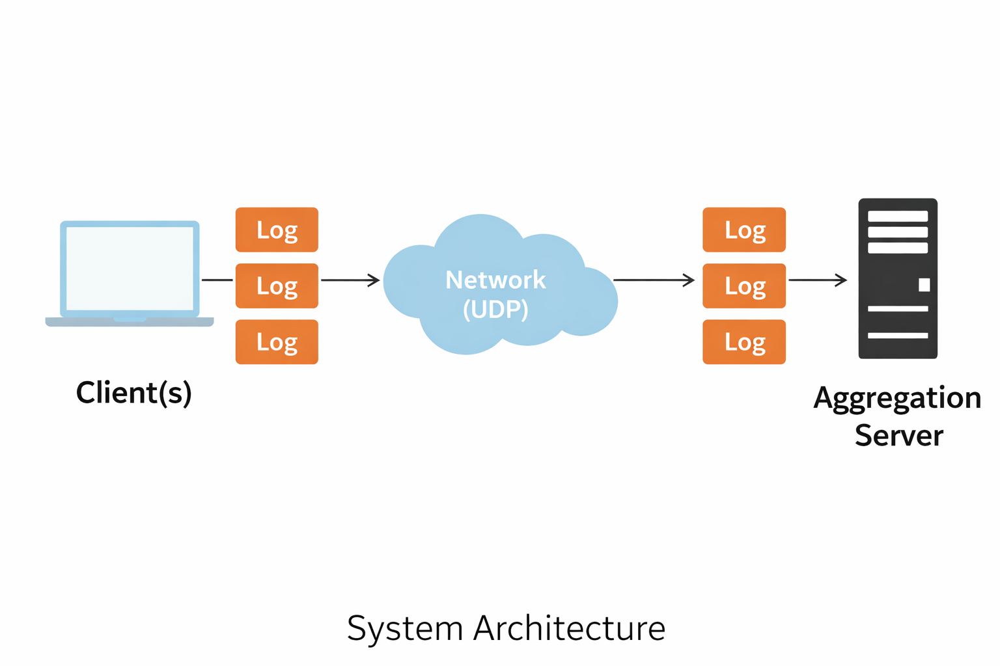

# Distributed-Log-Aggregation-System
Course: Computer Networks – Socket Programming Mini Project

Students:
- Kundan V – PES1UG24CS243
- Kuncha Pranay Krishna – PES1UG24CS242
- Anusri Sharma – PES1UG25CS803

## Project Overview
This project implements a distributed log aggregation system using UDP socket programming for fast, connectionless communication suitable for real-time log transmission. Multiple clients generate log messages and send them over the network to a centralized aggregation server. The server receives logs, timestamps and orders them based on arrival time, and processes them in real time while supporting multiple concurrent clients.

The system also evaluates performance using throughput measurement (logs per second) and implements backpressure handling by limiting the log queue size to prevent memory overload. Since UDP is unreliable, some log messages may be lost or received out of order.

## Features
- UDP Socket Communication – Low-level socket implementation
- Connectionless Communication – No handshake required between client and server
- Cryptographic Security – Logs can be encrypted before transmission and decrypted at the server  
- Real-Time Log Streaming – Clients continuously send log data  
- Multi-Client Support – Multiple clients can send logs simultaneously  
- Time Ordering – Logs are ordered using timestamps generated at the server upon reception  
- Throughput Evaluation – Server measures logs received per second  
- Backpressure Handling – Server queue limit prevents overload

## System Architecture
<p align="center">
  
</p>

Clients generate logs and send them to the server through the network using UDP sockets.  
The aggregation server receives and processes logs in real time.

Logs can be encrypted at the client and decrypted at the server to ensure secure transmission.

## Communication Model
Client sends log message:  
`timestamp | client_id | log_level | message`  

Example:  
```1717578803.7720332 | WINDOWS_CLIENT | INFO | Log message 74```  

Each log message is sent as a UDP datagram from the client to the server without establishing a connection, and without any guarantee of delivery or ordering.  
Server receives and processes logs while maintaining time ordering based on timestamps generated at the server.

## Installation & Setup
Prerequisites:
- Python 3
- Devices connected to the same network
- Cryptography library (Fernet-based encryption) installed

Both client and server must be connected to the same local network for UDP communication.

Setup Steps:
Clone the repository
```bash
git clone <your-repo-url>
cd Distributed-Log-Aggregation-System
```
Ensure Python is installed
```bash
python3 --version
```
Install required libraries
```bash
pip install cryptography
```
This library is used for encrypting logs at the client and decrypting them at the server.

Generate a secret key (run once)
```bash
python3 -c "from cryptography.fernet import Fernet; print(Fernet.generate_key())"
```
Update the secret key in client.py and server.py  
The same key must be used in both client and server for successful encryption and decryption.
```python
key = b'PASTE_YOUR_KEY_HERE'
```
Find server IP address (Mac)
```bash
ipconfig getifaddr en0
```
Update the server IP in client.py
```python
SERVER_IP = "YOUR_SERVER_IP"
```
Ensure the client uses the correct server IP address; otherwise, logs will not be received.

## Usage
Start the Server:
```bash
python3 server.py
```
Expected output  

```Server listening...```  

Ensure the server is running before starting any clients.

Start the Client:
```bash
python3 client.py
```
Clients will start sending log messages continuously to the server.  

Multi-Client Execution:  
Run multiple clients on different systems or multiple terminals on the same system.  

Example:
```bash
python3 client.py
python3 client.py
python3 client.py
```
The server will receive and process logs from all clients simultaneously in real time.

## Performance Evaluation
The server measures throughput as:  
```Throughput: XX logs/sec```  

Throughput indicates how many logs the server can process per second under continuous load.  
This metric is used to evaluate system performance under continuous log transmission.

## Backpressure Handling
To prevent memory overload:
- Server log queue is limited to 100 logs
- Old logs are automatically removed when the limit is exceeded

This ensures stable performance even under heavy log traffic. This mechanism prevents unbounded memory growth during high log traffic.

## Sample Output
Example server output:
```
[('10.30.203.57', 56672)] WINDOWS_CLIENT | INFO | Log message 74
[('10.30.203.57', 56672)] WINDOWS_CLIENT | INFO | Log message 76
Throughput: 25 logs/sec
```

The output displays the client IP, port, log details, and real-time throughput, with logs ordered based on server timestamps.  
Each entry represents a log received as a UDP datagram from a client.

## Technologies Used
Language: Python  
Networking: UDP Sockets  
Libraries: socket, time  
Operating Systems: Mac (Server), Windows/Ubuntu (Clients)

## Project Structure
```
Distributed-Log-Aggregation-System/
│
├── Architecture/
│   └── Architecture.png
├── Client/
│   └── Client.py
├── Output/
│   ├── Backpressure.png
│   ├── Client.jpeg
│   ├── Client_1.jpeg
│   ├── Client_2.jpeg
│   ├── Server.png
│   ├── Server_1_2.png
│   └── Throughput.png
├── Server/
│   └── Server.py
├── .gitignore
└── README.md
```

## Future Improvements
Secure communication using DTLS (Datagram Transport Layer Security)  
Log storage in database  
Log filtering and search functionality  
Web dashboard for monitoring  
Visualization of log statistics  
Reliable delivery mechanisms (acknowledgment and retransmission)

## License
This project is created for educational purposes as part of the Computer Networks mini project.

## Acknowledgments
Course: Computer Networks  
Institution: PES University  
Project Type: Socket Programming Mini Project
